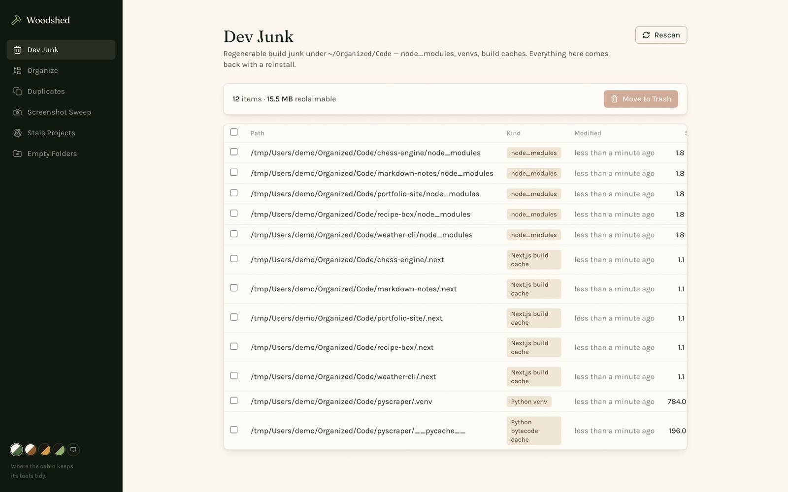

# Woodshed

> Where the cabin keeps its tools tidy.

A disk-tidying workbench for a developer machine: find the junk, see what it's costing you, and clear it out — with an undo for everything that moves.



## What it does

**Dev junk** — finds the regenerable directories that quietly eat a drive (`node_modules`, `.venv`, `__pycache__`, build output) and reports what each is worth reclaiming, with a hint for how to restore it (`npm install`, `python -m venv .venv`). Nothing irreplaceable is ever on the list.

**Duplicates** — content-hashed, not name-matched, so copies with different filenames are still caught.

**Empty folders** and **stale projects** — directories nothing has touched in a long time, checked against their git status so an untouched repo with uncommitted work doesn't get quietly labelled abandoned.

**Screenshots** — the desktop pile-up, sorted and clearable in one pass.

**Organize** — sorts loose files into Images / Documents / Archives / Code by extension. Every run is previewed before it happens, logged, and reversible: the undo restores every file to exactly where it came from.

Deletions go to the macOS Trash, never `rm`. Paths are checked against a safety guard before anything is touched.

## Stack

Next.js 16 (App Router) · React 19 · TypeScript · Tailwind 4. No database — scans are live and run state lives in `.runtime/`.

## Running it

```bash
npm install
npm run dev
```

Then open <http://localhost:3002>.

## The cabin

Part of a set of local-first apps launched from [The Lodge](https://github.com/CamWhamBammus/the-lodge).
